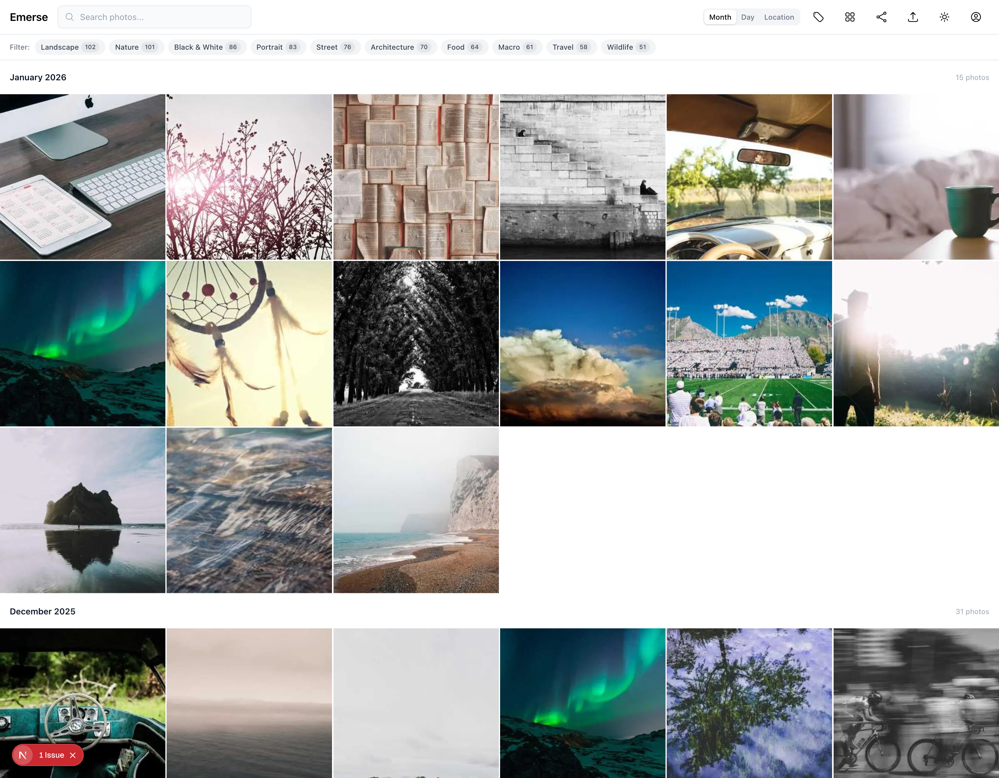
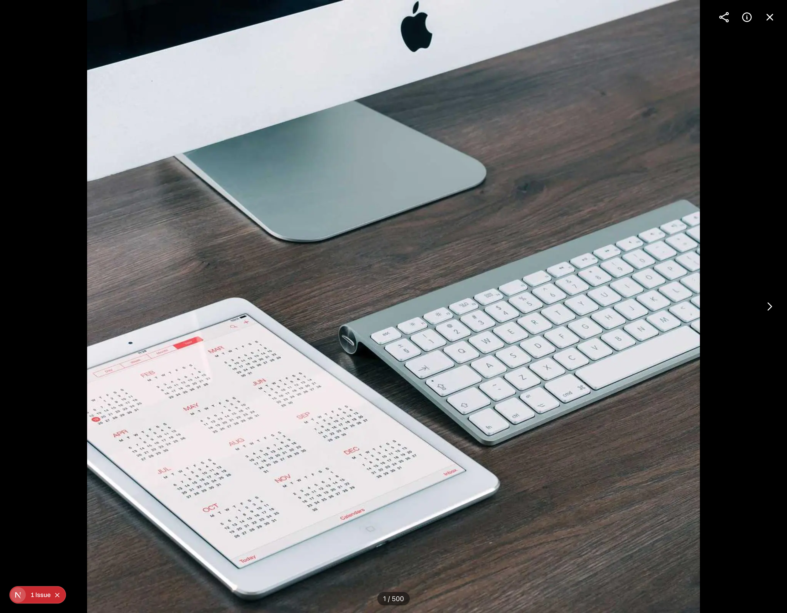
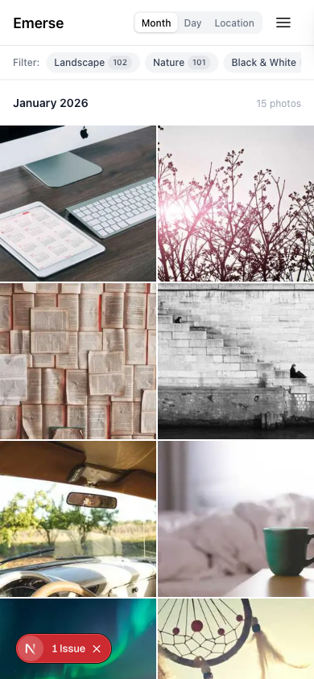

# Emerse

A Progressive Web App (PWA) for personal photo portfolio management. Upload, organize, and browse photos with an intuitive mobile-first interface featuring dynamic clustering and gesture-based navigation.

## Features

- **Photo Upload** - Multi-resolution compression (thumbnail, small, medium, large, original)
- **Smart Clustering** - Automatic grouping by date and location
- **Gesture Navigation** - Pinch-to-zoom grid with smooth animations
- **Photo Viewer** - Full-screen view with swipe navigation
- **PWA** - Installable, offline support, native-like experience
- **Selection Mode** - Multi-select photos for batch operations

## Screenshots

### Desktop Grid View


### Photo Viewer


### Mobile View


## Tech Stack

- **Framework:** Next.js 16 with React 19
- **Language:** TypeScript
- **Styling:** Tailwind CSS 4
- **Database:** PostgreSQL with Prisma ORM
- **Storage:** Amazon S3 with presigned URLs
- **Auth:** NextAuth.js
- **Image Processing:** Sharp.js, browser-image-compression
- **Testing:** Playwright

## Prerequisites

- Node.js 18+ or Bun
- PostgreSQL (local or cloud)
- AWS account (for S3 storage)

## Getting Started

### 1. Clone the repository

```bash
git clone git@github.com:mcotse/emerse.git
cd emerse
```

### 2. Install dependencies

```bash
bun install
# or
npm install
```

### 3. Set up environment variables

Copy the example env file and fill in your values:

```bash
cp .env.example .env
```

Required variables:
```
DATABASE_URL="postgresql://..."
AUTH_SECRET="your-auth-secret"
AWS_REGION="us-east-1"
AWS_ACCESS_KEY_ID="..."
AWS_SECRET_ACCESS_KEY="..."
S3_BUCKET_NAME="your-bucket-name"
```

### 4. Set up the database

```bash
# Generate Prisma client
bun run db:generate

# Push schema to database
bun run db:push
```

### 5. Run the development server

```bash
bun run dev
```

Open [http://localhost:3000](http://localhost:3000) in your browser.

## Scripts

| Command | Description |
|---------|-------------|
| `bun run dev` | Start development server |
| `bun run build` | Build for production |
| `bun run start` | Start production server |
| `bun run lint` | Run ESLint |
| `bun run typecheck` | Run TypeScript type checking |
| `bun run test` | Run Playwright tests |
| `bun run test:ui` | Run Playwright tests with UI |
| `bun run db:generate` | Generate Prisma client |
| `bun run db:push` | Push schema to database |
| `bun run db:studio` | Open Prisma Studio |

## Project Structure

```
src/
├── app/          # Next.js app router pages
├── components/   # React components
├── hooks/        # Custom React hooks
├── lib/          # Utilities and configurations
├── types/        # TypeScript type definitions
└── middleware.ts # Auth middleware
```

## Manual Setup

For detailed instructions on setting up AWS S3, database, and authentication, see [MANUAL_SETUP.md](./MANUAL_SETUP.md).

## Documentation

- [PRD.md](./PRD.md) - Product requirements and work breakdown
- [MANUAL_SETUP.md](./MANUAL_SETUP.md) - Infrastructure setup guide
- [CLAUDE.md](./CLAUDE.md) - AI assistant guidelines

## License

Private project.
